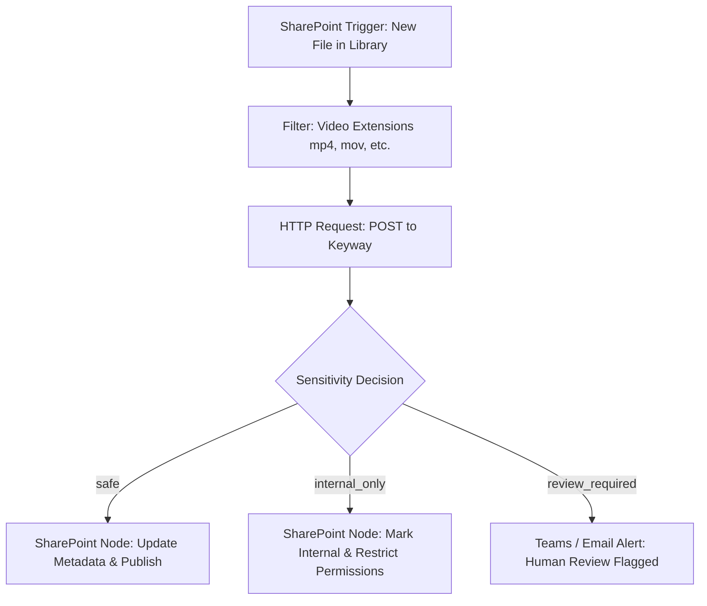

# n8n Workflow Integration Guide

This guide describes the architecture and configuration for orchestrating Keyway from an n8n workflow.

---

## 1. Architectural Boundary

n8n serves as the **orchestrator and business logic layer**:
- Watches / polls SharePoint document library for new training video uploads.
- Issues a small JSON HTTP POST request to Keyway.
- **Never streams or downloads large video files directly** into n8n memory.
- Receives structured processing metadata and telemetry back from Keyway.
- Writes metadata (Title, Synopsis, Sensitivity, Date, Processing stats) back to SharePoint columns.
- Holds videos classified as `review_required` (or flagged `internal_only`) in a human approval queue (e.g. Teams notification, approval task).

Keyway serves as the **heavy media worker**:
- Retrieves media directly (via local mount or constrained Microsoft Graph client).
- Extracts and normalizes audio via `ffmpeg`.
- Transcribes locally via `faster-whisper`.
- Classifies metadata and sensitivity via OpenAI-compatible or local Ollama backend.
- Emits `transcript.txt` and `result.json` artifacts and returns JSON response.

---

## 2. Network Topology

Run Keyway and n8n on the same user-defined Docker network (e.g., `infra_internal` or `n8n_default`).

```
+----------------------------------------------------------------+
|                        Unraid Host                             |
|                                                                |
|   +-------------------+        HTTP POST       +-----------+   |
|   |   n8n Container   | ---------------------> |  Keyway   |   |
|   |                   | <--------------------- | Container |   |
|   +-------------------+       Structured       +-----------+   |
|             |                    JSON                |         |
|             |                                        |         |
+-------------|----------------------------------------|---------+
              |                                        |
       Graph Metadata                            Graph Content
         Write-Back                                 Download
              |                                        |
              v                                        v
  +--------------------------------------------------------------+
  |              Microsoft 365 / SharePoint Online               |
  +--------------------------------------------------------------+
```

Keyway endpoint from n8n:
`http://keyway:8000/v1/process/sharepoint` (or `http://keyway:8000/v1/process/local` if sharing media volume)

---

## 3. HTTP Request Payloads

### A. SharePoint Remote Source (`/v1/process/sharepoint`)

In n8n HTTP Request node:
- **Method**: `POST`
- **URL**: `http://keyway:8000/v1/process/sharepoint`
- **Timeout**: `7200000` (Keyway processing timeout: adjust for long media)
- **Body Content Type**: `JSON`
- **JSON Body**:
```json
{
  "job_id": "={{ $json.id || $execution.id }}",
  "site_id": "={{ $json.site_id }}",
  "drive_id": "={{ $json.drive_id }}",
  "item_id": "={{ $json.item_id }}",
  "filename": "={{ $json.name }}"
}
```

### B. Local Mount Source (`/v1/process/local`)

If video library is mounted to both n8n and Keyway containers at `/media`:
- **Method**: `POST`
- **URL**: `http://keyway:8000/v1/process/local`
- **JSON Body**:
```json
{
  "job_id": "={{ $json.id || $execution.id }}",
  "source_path": "=/media/{{ $json.filename }}"
}
```

---

## 4. Response Payload Contract

On `HTTP 200`, Keyway returns:

```json
{
  "success": true,
  "source_filename": "2021-08-19 12.01 P_T (SCS).mp4",
  "presentation_date": "2021-08-19",
  "presentation_date_source": "filename",
  "title": "Revit Coordination and Dynamo Level Verification",
  "synopsis": "Internal training covering Revit parameters, Finlink integration, and Dynamo scripts for verifying elements associated with levels.",
  "sensitivity": "safe",
  "sensitivity_reason": "Routine software training and engineering methodologies with no confidential or financial client information.",
  "transcription": {
    "model": "small.en",
    "device": "cuda",
    "compute_type": "float16",
    "duration_seconds": 3393.828,
    "processing_seconds": 95.120,
    "realtime_factor": 0.0280
  },
  "total_processing_seconds": 112.450,
  "warnings": []
}
```

---

## 5. Sample n8n Workflow Sequence



### Steps:
1. **Trigger**: SharePoint node or Microsoft Graph webhook on library `Created` or `Modified`.
2. **Filter**: Check filename extension against `mp4`, `mov`, `mkv`, `avi`, `webm`. Check if metadata already written to avoid loops.
3. **Keyway Call**: Call Keyway `POST /v1/process/sharepoint`.
4. **Switch / IF Node**:
   - Expression: `{{ $json.sensitivity }}`
   - Route `safe`: Write `title`, `synopsis`, `presentation_date` into SharePoint document library fields.
   - Route `internal_only`: Set tag `Internal Only`.
   - Route `review_required`: Hold status as `Pending Review` and post notification with `sensitivity_reason` to a Teams review channel.
