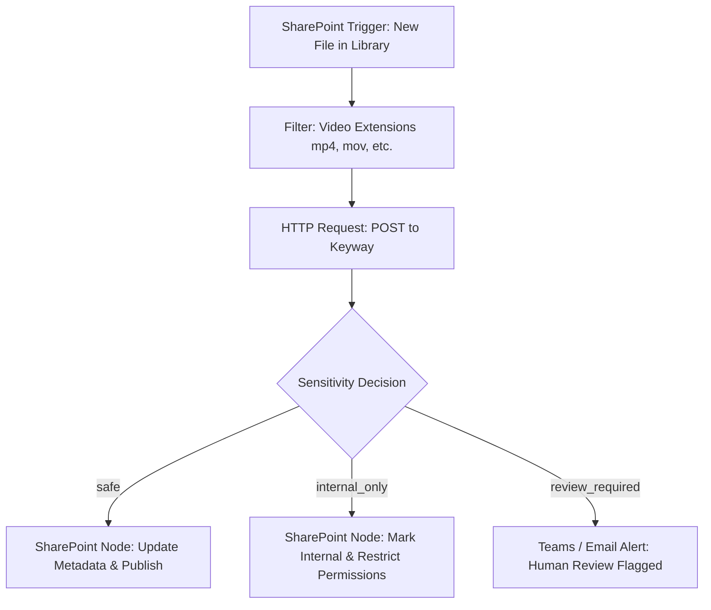

# n8n Workflow Integration Guide

This guide describes the architecture and configuration for orchestrating Keyway from an n8n workflow.

---

## 0. The live instance (surveyed 2026-09-06, read-only)

- **n8n** 2.37.10 in container `n8n` on `pes-dev`, published at `https://n8n.pesengineers.dev` through the Cloudflared tunnel. Attached to both `bridge` and `keyway-net`.
- **Agent access** is via n8n's built-in MCP server at `https://n8n.pesengineers.dev/mcp-server/http` (bearer token in env `N8N_PES_MCP_API_Key`, 1Password "n8n PES Dev API Key"). `.omp/mcp.json` registers it as `n8n-pesdev`. It exposes 39 tools including workflow search/details/history, execution search, data-table read/write, node discovery, and `create_workflow_from_code` / `publish_workflow`. Only workflows individually marked "Available in MCP" are visible.

### Existing workflows: reference only, do not modify

Two workflows implement the pre-Keyway design. They are **frozen**: do not edit, activate, execute, or publish them. Duplicate under a new name if a starting point is needed.

| Workflow | ID | State | Notes |
|---|---|---|---|
| PES Video Metadata - Seed Queue | `QuB7hRjGqdnPGRnF` | inactive | Manual trigger. Lists a SharePoint drive folder via Graph (`$top=200`), filters to videos, inserts rows into data table `video_metadata_queue`. Last run 2026-09-05 succeeded (100 rows). |
| PES Video Metadata - Process Queue | `84xNMHd9xDyKWgbd` | inactive, **never executed** | Every 15 min: take 5 `pending` rows, get drive item, if >24 MB send to CloudConvert for audio compression (poll twice), download, OpenAI Whisper API, gpt-4o-mini structured metadata, sensitivity branch, PATCH SharePoint list item, mark row done/error/flagged. |

Useful shared pieces (copy, do not move):

- **Data table** `video_metadata_queue` (id `QMOVCsZrJKJuT2Cz`, project `CdjCqhKMTfc43TGa`). Columns: `sourceItemId, driveItemId, fileName, webUrl, fileSizeBytes, status, title, presentationDate, synopsis, isSensitive, sensitivityReason, errorMessage, attemptCount, lastAttemptAt`. Status values used: `pending`, `done`, `error`, `flagged_sensitive`.
- **Queue contents** at survey time: 100 rows, all `pending`, 26.2 GB total, largest 1.8 GB, 96 of 100 over the 24 MB API limit, 98 mp4 / 1 mkv / 1 wmv. Only 6 of 100 filenames start with `YYYY-MM-DD`, so model-inferred dates will be the common case and `presentation_date_source` will usually be `model` or `unknown`.
- **SharePoint target** (Config node): site `pes1852.sharepoint.com,97c4bdef-10db-4a0a-b359-050ced66dd51,316269b2-8c0d-438a-9466-a3a1f9800a8a`, list `d5aef84f-d0e2-4a89-873c-7c9db6b6e059`, library "PES Documents / Continuing Education / Recordings & Video User Guides". Fields written: `Title`, `Synopsis` (truncated to 255 chars for the column), `Presentation_x0020_Date` as `YYYY-MM-DDT00:00:00Z`.
- **Graph auth** for reads and the PATCH uses n8n's stored credential; Keyway does not need it for the local-mount flow.

### What Keyway replaces

In Process Queue, everything between "Get Drive Item Info" and "Parse Metadata Response" (compression decision, CloudConvert create/poll/download, Whisper API, gpt-4o-mini, parse) collapses into one HTTP Request node calling Keyway. The queue, loop, error/flag marking, and SharePoint PATCH stay as they are. Field mapping from Keyway's response to the existing downstream nodes:

| Existing expression | Keyway field |
|---|---|
| `title` | `title` |
| `synopsis` | `synopsis` (n8n still truncates to 255 for SharePoint) |
| `presentationDate` | `presentation_date` (may be null; also `presentation_date_source`) |
| `isSensitive` | `sensitivity != "safe"` (or route the three values separately) |
| `sensitivityReason` | `sensitivity_reason` |

Keyway adds `transcription.*` telemetry and `warnings`, which have no column today; consider adding `processingSeconds` and `device` to the data table in the new workflow.

---

## 1. Architectural Boundary

n8n serves as the **orchestrator and business logic layer**:
- Watches / polls SharePoint document library for new training video uploads.
- Issues a small JSON HTTP POST request to Keyway.
- **Never streams or downloads large video files directly** into n8n memory.
- Receives structured processing metadata and telemetry back from Keyway.
- Writes metadata (Title, Synopsis, Sensitivity, Date, Processing stats) back to SharePoint columns.
- Holds videos classified as `review_required` (or flagged `internal_only`) in a human approval queue (e.g. Teams notification, approval task).

Keyway serves as the **heavy media worker**:
- Retrieves media directly (via local mount or constrained Microsoft Graph client).
- Extracts and normalizes audio via `ffmpeg`.
- Transcribes locally via `faster-whisper`.
- Classifies metadata and sensitivity via OpenAI-compatible or local Ollama backend.
- Emits `transcript.txt` and `result.json` artifacts and returns JSON response.

---

## 2. Network Topology

Run Keyway and n8n on the same user-defined Docker network (e.g., `infra_internal` or `n8n_default`).

```
+----------------------------------------------------------------+
|                        Unraid Host                             |
|                                                                |
|   +-------------------+        HTTP POST       +-----------+   |
|   |   n8n Container   | ---------------------> |  Keyway   |   |
|   |                   | <--------------------- | Container |   |
|   +-------------------+       Structured       +-----------+   |
|             |                    JSON                |         |
|             |                                        |         |
+-------------|----------------------------------------|---------+
              |                                        |
       Graph Metadata                            Graph Content
         Write-Back                                 Download
              |                                        |
              v                                        v
  +--------------------------------------------------------------+
  |              Microsoft 365 / SharePoint Online               |
  +--------------------------------------------------------------+
```

Keyway endpoint from n8n:
`http://keyway:8000/v1/process/sharepoint` (or `http://keyway:8000/v1/process/local` if sharing media volume)

---

## 3. HTTP Request Payloads

### A. SharePoint Remote Source (`/v1/process/sharepoint`)

In n8n HTTP Request node:
- **Method**: `POST`
- **URL**: `http://keyway:8000/v1/process/sharepoint`
- **Timeout**: `7200000` (Keyway processing timeout: adjust for long media)
- **Body Content Type**: `JSON`
- **JSON Body**:
```json
{
  "job_id": "={{ $json.id || $execution.id }}",
  "site_id": "={{ $json.site_id }}",
  "drive_id": "={{ $json.drive_id }}",
  "item_id": "={{ $json.item_id }}",
  "filename": "={{ $json.name }}"
}
```

### B. Local Mount Source (`/v1/process/local`)

If video library is mounted to both n8n and Keyway containers at `/media`:
- **Method**: `POST`
- **URL**: `http://keyway:8000/v1/process/local`
- **JSON Body**:
```json
{
  "job_id": "={{ $json.id || $execution.id }}",
  "source_path": "=/media/{{ $json.filename }}"
}
```

---

## 4. Response Payload Contract

On `HTTP 200`, Keyway returns:

```json
{
  "success": true,
  "source_filename": "2021-08-19 12.01 P_T (SCS).mp4",
  "presentation_date": "2021-08-19",
  "presentation_date_source": "filename",
  "title": "Revit Coordination and Dynamo Level Verification",
  "synopsis": "Internal training covering Revit parameters, Finlink integration, and Dynamo scripts for verifying elements associated with levels.",
  "sensitivity": "safe",
  "sensitivity_reason": "Routine software training and engineering methodologies with no confidential or financial client information.",
  "transcription": {
    "model": "small.en",
    "device": "cuda",
    "compute_type": "float16",
    "duration_seconds": 3393.828,
    "processing_seconds": 95.120,
    "realtime_factor": 0.0280
  },
  "total_processing_seconds": 112.450,
  "warnings": []
}
```

---

### Error responses

Non-200 responses are `{"detail": "<message>"}`. The status code tells the workflow what to do; set the HTTP Request node to "Continue on error" and branch on `$json.statusCode` (or the error output).

| Status | Meaning | Workflow action |
|---|---|---|
| 400 | Request rejected before processing (path outside allowed roots, bad `job_id`) | fix the workflow; do not retry |
| 422 | The media itself is the problem: unsupported container, ffmpeg cannot decode it, or **no speech detected** (silent recording) | mark the row terminal (e.g. `no_audio` / `unprocessable`) with the `detail` text; do not retry |
| 502 | An upstream dependency failed: SharePoint/Graph download or the analysis backend (Ollama) | mark `error`, increment `attemptCount`, retry on the next cycle |
| 500 | Worker fault (CUDA crash, unexpected exception) | mark `error`, retry once; alert if it repeats |
| 503 | `/ready` failing: worker misconfigured or a mount is unwritable | stop the loop; operator attention |

The 422 for silence is deliberate: the first queue item tested (`Non-Technical-20251022_155731UTC-Meeting Recording.mp4`) is 50 s of digital silence (max volume -91 dB). Retrying it forever would be wasteful; a distinct status lets the workflow park it for a human.

## 5. Sample n8n Workflow Sequence



### Steps:
1. **Trigger**: SharePoint node or Microsoft Graph webhook on library `Created` or `Modified`.
2. **Filter**: Check filename extension against `mp4`, `mov`, `mkv`, `avi`, `webm`. Check if metadata already written to avoid loops.
3. **Keyway Call**: Call Keyway `POST /v1/process/sharepoint`.
4. **Switch / IF Node**:
   - Expression: `{{ $json.sensitivity }}`
   - Route `safe`: Write `title`, `synopsis`, `presentation_date` into SharePoint document library fields.
   - Route `internal_only`: Set tag `Internal Only`.
   - Route `review_required`: Hold status as `Pending Review` and post notification with `sensitivity_reason` to a Teams review channel.

---

## 6. The Keyway workflow (created 2026-09-06)

**`Keyway - Process Queue`**, id `mp5gviKuHu9iIfPo`, https://n8n.pesengineers.dev/workflow/mp5gviKuHu9iIfPo. Created **inactive**. Source of truth is `n8n/keyway-process-queue.workflow.ts` in this repo (n8n Workflow SDK code); the n8n copy is a deployment of that file.

Shape: Schedule (15 min) → Config → Get One Pending Row (limit 1, oldest first) → loop → Mark Row Processing (+attemptCount, lastAttemptAt) → POST `/v1/process/sharepoint` (`fullResponse` + `neverError`, 30 min timeout) → Route By HTTP Status → for 200, Route By Sensitivity.

| Outcome | Row status written | SharePoint write |
|---|---|---|
| 200, `safe` | `done` (+ title, synopsis, presentationDate, sensitivityReason, isSensitive=false) | yes: Title, Synopsis (255 max), Presentation Date |
| 200, `internal_only` | `flagged_internal` (+ fields, isSensitive=true) | no |
| 200, `review_required` | `flagged_review` (+ fields, isSensitive=true) | no |
| 422 | `unprocessable` (+ errorMessage from `detail`) | no; not retried |
| other | `error` (+ errorMessage `HTTP <code>: <detail>`) | no; picked up again only if a human resets status to `pending` |

Design notes:

- Uses only existing columns of `video_metadata_queue`; the new information lives in the `status` vocabulary. Adding a `sensitivity` column would be cleaner but is a schema change to the shared table and needs approval (ADR 005).
- One row per run because Keyway runs one job at a time; raising `limit` above 1 would just queue inside Keyway. Marking `processing` first prevents a double pick-up if a job outlasts the 15-minute interval.
- `error` rows are **not** auto-retried. That is deliberate for the first weeks: a human looks at `errorMessage`, then flips `status` back to `pending`. Once the failure modes are understood, a "retry if attemptCount < 3" filter can be added to Get One Pending Row.
- `job_id` sent to Keyway is `queue-<row id>`, so artifacts land at `/mnt/user/appdata/keyway/output/queue-<id>/`.
- The SharePoint PATCH reuses credential `Sharepoint video process` (`icIlll1oh3FEHtYl`), the same one the frozen workflow uses.

### Deploy or update from source

With the MCP server (token in `N8N_PES_MCP_API_Key`):

1. `get_workflow_sdk_reference` (the server requires it before code tools work).
2. `validate_workflow` with the file contents; fix until `valid: true` and no warnings.
3. First time: `create_workflow_from_code` with `name: "Keyway - Process Queue"`. Updates: use the workflow's edit/update tool with the same code against id `mp5gviKuHu9iIfPo`. Never point it at the frozen workflow ids.
4. In the UI, open the workflow, check the SharePoint node still shows the credential, run once manually with the schedule disabled, inspect the row and the SharePoint item, then activate.

SDK quirks learned: `sticky(text, nodes?, config?)` is positional, not `sticky({config})`; string concatenation with `+` is not folded, use one literal; the loop's `nextBatch(loop)` must terminate every branch.

### Activation checklist

- [ ] Keyway container is on the image that returns 422 for silence (commit `314281a` or later).
- [ ] Graph secret has been rotated.
- [ ] Manual test run on one row succeeds end to end (row `done`, SharePoint fields populated).
- [ ] Agree who reviews `flagged_*` and `error` rows and how often.
- [ ] Activate. First cycle runs within 15 minutes; 100 rows at one per cycle is roughly 25 hours. Shorten the interval to 5 minutes once stable (Keyway takes about a minute per hour of video).

